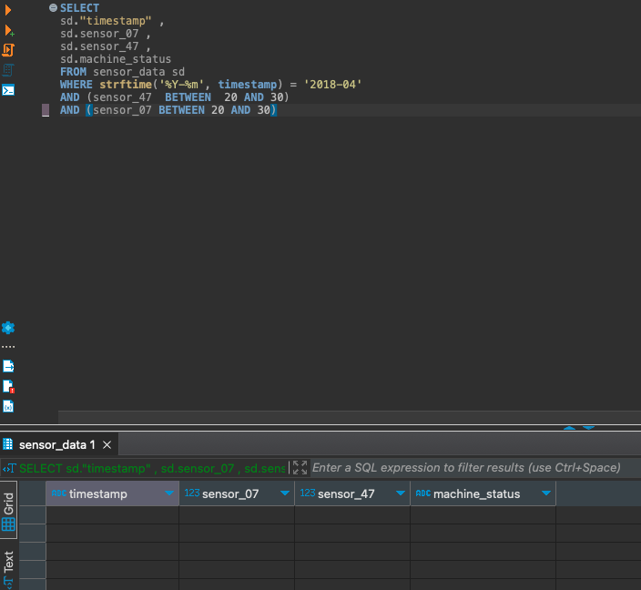
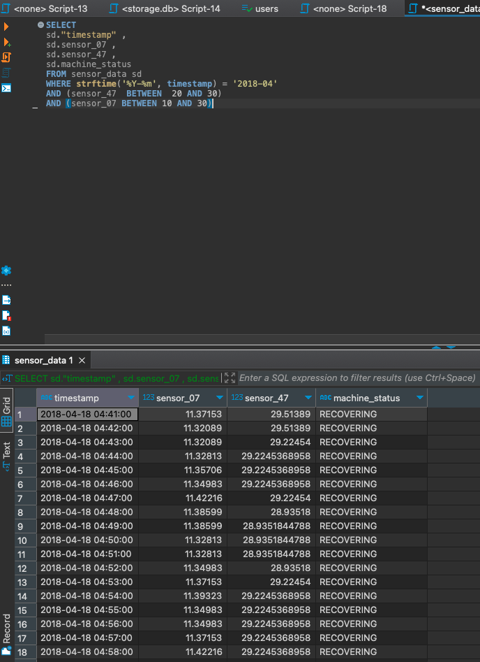

# Pump Sensor Data API

Author: [Rodrigo Anderson](https://github.com/ro-anderson) - Software Engineer


The Pump Sensor Data API is a FastAPI-based project designed to interact with pump sensor data, originating from [this Kaggle dataset](https://www.kaggle.com/datasets/nphantawee/pump-sensor-data). This study case focuses on practicing API building and handling sensor data. The API provides two main endpoints, offering specific functionalities for filtering sensor data based on predefined criteria and for receiving and organizing the data in a specific format.

## Disclaimers

1. **Database Format and File Management:**

   The original dataset for this project was obtained in CSV format from [Kaggle's Pump Sensor Data project](https://www.kaggle.com/datasets/nphantawee/pump-sensor-data). However, to facilitate data management and improve query performance, it was decided to convert this data into an SQLite database. SQLite offers a lightweight, file-based database solution that doesn't require a separate server process, making it a convenient choice for this project.

   However, it's worth noting that the size of the SQLite database file (`sensor_data.db`) exceeded GitHub's file size limits. Although it's generally not considered best practice to include a database file in a repository, it was necessary to make the project easy to set up and run. To address the size limitation, the database file was compressed into a ZIP file (`sensor_data.db.zip`), which is included in the repository.

   **To use the database, you have two options:**

   - **Unzip the Provided File:** Simply unzip `sensor_data.db.zip` to create the `sensor_data.db` file at the root of the project. This is the quickest way to get started.
   
   - **Recreate the Database (Optional):** If you prefer to recreate the database yourself, follow these steps:
      
      **i.** Download the `sensor.csv` file from [Kaggle](https://www.kaggle.com/datasets/nphantawee/pump-sensor-data) and place it in the root directory of the project.
      
      **ii.** Inside a virtual environment (conda, python venv, etc) with `pandas` installed, run:
        ```bash
        python create_db.py
        ```

2. **Data Filtering Constraints:**

   During the initial stages of the project, the idea was to filter data from April 2018 for sensors 07 and 47, with values greater than 20 and less than 30. However, applying these constraints resulted in an empty table, as shown below:
   
   
   
   This outcome was not aligned with the project's objectives, so a decision was made to modify the constraints to include more data. The updated constraints are:
   
   - Include values greater than 20 and less than 30 for sensor_47.
   - Include values greater than 10 and less than 30 for sensor_07.
   
   The new constraints allow for meaningful data representation, as evidenced in the following query result:
   
   
   
   These adjustments maintain the project's alignment with its original intent, while ensuring that the filtered data is representative and meaningful.

## Features

1. **GET Endpoint**: Filters the sensor data from April 2018 for sensors 07 and 47 with the values according to the constraints mentioned in the disclaimers.

2. **POST Endpoint**: Receives the filtered data and organizes it into a Pandas DataFrame - also print the dataframe at the terminal.

## Installation and Running

### With Docker Compose (Recommended)

1. Clone the repository to your local machine.
2. Ensure you have [Docker](https://docs.docker.com/get-docker/) and [Docker Compose](https://docs.docker.com/compose/install/) installed.
3. Ensure that the `sensor_data.db.zip` file is present in the root directory of the project, and unzip it to extract `sensor_data.db`. Alternatively, you can download the `sensor.csv` file from [Kaggle](https://www.kaggle.com/datasets/nphantawee/pump-sensor-data), place it in the root directory, and run the following command in a Python environment containing the Pandas library:

   ```bash
   python create_db.py
   ```

4. Run the following command to build and start the containers for the production server:

   ```bash
   docker-compose up app
   ```

   This will start the server locally, and you can access the API and its documentation at `http://0.0.0.0:5001/docs`.

### Running Tests

1. If you want to run the tests, you can execute the following command:

   ```bash
   docker-compose up test
   ```

   This will run the tests inside the Docker container and display the results in the console.

### With Poetry (Local Development)

1. Clone the repository to your local machine.
2. unzip the `sensor_data.db.zip` file.
  - On Linux:
  ```bash
# Install unzip utility
sudo apt-get update && sudo apt-get install -y unzip

# Unzip the sensor_data.db.zip file (must be on project root folder)
unzip sensor_data.db.zip
  ```
2. Install [Poetry](https://python-poetry.org/docs/#installation).
  - on Linux:
  ```bash
  # Install poetry
curl -sSL https://install.python-poetry.org | python -
  ```

3. Run the following commands:

   ```bash
   poetry install
   make run
   ```

### Running Tests

1. If you want to run the tests, after creating the poetry setup, you can execute the following command:

   ```bash
   make test 
   ```

   This will run the tests locally and display the results in the console.

## API Endpoints

### GET Request

Endpoint: `http://0.0.0.0:5001/data`

CURL Example:

```bash
curl -X 'GET' \
  'http://0.0.0.0:5001/data' \
  -H 'accept: application/json'
```

### POST Request

Endpoint: `http://0.0.0.0:5001/receiveData`

CURL Example:

```bash
curl -X 'POST' \
  'http://0.0.0.0:5001/receiveData' \
  -H 'accept: application/json' \
  -H 'Content-Type: application/json' \
  -d '{
  "data": [
    {
      "timestamp": "2018-04-18 04:41:00",
      "machine_status": "RECOVERING",
      "sensors": [
        {
          "name": "sensor_07",
          "value": 11.37153
        },
        {
          "name": "sensor_47",
          "value": 29.513890000000004
        }
      ]
    },
    {
      "timestamp": "2018-04-18 04:42:00",
      "machine_status": "RECOVERING",
      "sensors": [
        {
          "name": "sensor_07",
          "value": 11.32089
        },
        {
          "name": "sensor_47",
          "value": 29.513890000000004
        }
      ]
    },
    {
      "timestamp": "2018-04-18 04:43:00",
      "machine_status": "RECOVERING",
      "sensors": [
        {
          "name": "sensor_07",
          "value": 11.32089
        },
        {
          "name": "sensor_47",
          "value": 29.22454
        }
      ]
    },
    {
      "timestamp": "2018-04-18 04:44:00",
      "machine_status": "RECOVERING",
      "sensors": [
        {
          "name": "sensor_07",
          "value": 11.32813
        },
        {
          "name": "sensor_47",
          "value": 29.224536895752
        }
      ]
    }
  ]
}'
```

## Swagger Documentation

The application uses FastAPI, and you can access the automatically generated Swagger UI at:

[http://0.0.0.0:5001/docs#](http://0.0.0.0:5001/docs#)

### Main Swagger Page

Here you can explore the API's endpoints, data structures, and more. The main page provides an overview of the available API methods.

 <!-- Replace with the actual path to the screenshot -->

### Executing Requests Through Swagger UI

You can also execute API requests directly from the Swagger UI. Simply click on the endpoint you want to try, fill in any required parameters, and hit the "Execute" button.

 <!-- Replace with the actual path to the screenshot -->
