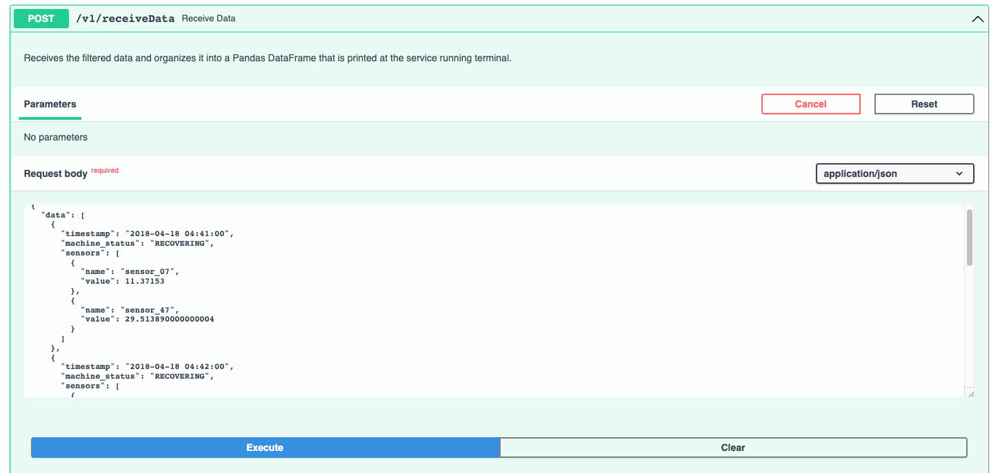

# Pump Sensor Data API

The Pump Sensor Data API is a FastAPI-based project that provides two main endpoints for working with pump sensor data. The API provides functionalities for filtering specific sensor data based on predefined criteria and for receiving and organizing the data in a specific format.

## Disclaimers

1. **Download the Sensor Data (Optional):**
   
   The `sensor.csv` file is not included in the repository, but you don't need it to run the project as the `sensor_data.db.zip` is on the repo - You just need to unzip this file and create the `sensor_data.db` at the root of the project 
   
   - If you want to recreate the database yourself, you should:
      
      **i.** Download the `sensor.csv` file from [Kaggle](https://www.kaggle.com/datasets/nphantawee/pump-sensor-data) and place it in the root directory of the project.
      
      **ii.** Inside a virtualenv (conda, python venv, etc) with `pandas`installed you should run:
        ```bash
        python create_db.py
        ```

2. **Data Filtering Constraints:**
  
    At the project scope, the original constraints were to filter data from April 2018 for sensors 07 and 47 with values greater than 20 and less than 30. However, applying these constraints resulted in an empty table result. To maintain alignment with the project's intent, the following constraints are applied instead:
   - Include values greater than 20 and less than 30 (sensor_47).
   - Include values greater than 10 and less than 30 (sensor_07).

3. **Database File Inclusion:**
   
   Although it is not considered best practice to include a database file in a repository, it has been included here for ease of use by others developers as: `sensor_data.db.zip`

## Features

1. **GET Endpoint**: Filters the sensor data from April 2018 for sensors 07 and 47 with the values according to the constraints mentioned in the disclaimers.

2. **POST Endpoint**: Receives the filtered data and organizes it into a Pandas DataFrame.

## Installation and Runnig

### With Docker Compose (Recommended)

1. Clone the repository to your local machine.
2. Ensure you have [Docker](https://docs.docker.com/get-docker/) and [Docker Compose](https://docs.docker.com/compose/install/) installed.
3. Download the `sensor.csv` file from [Kaggle](https://www.kaggle.com/datasets/nphantawee/pump-sensor-data).
4. Run the following command to create the SQLite database:

   ```bash
   make create_db
   ```

5. Run the following command to build and start the containers:

   ```bash
   docker-compose up --build
   ```


### With Poetry (Local Development)

1. Clone the repository to your local machine.
2. unzip the `sensor_data.db.zip` file.
  - On Linux:
  ```bash
# Install unzip utility
sudo apt-get update && sudo apt-get install -y unzip

# Unzip the sensor_data.db.zip file (must be on project root folder)
unzip sensor_data.db.zip
  ```
2. Install [Poetry](https://python-poetry.org/docs/#installation).
  - on Linux:
  ```bash
  # Install poetry
curl -sSL https://install.python-poetry.org | python -
  ```

3. Run the following commands:

   ```bash
   poetry install
   make run
   ```


## API Endpoints

### GET Request

Endpoint: `http://0.0.0.0:5001/data`

CURL Example:

```bash
curl -X 'GET' \
  'http://0.0.0.0:5001/data' \
  -H 'accept: application/json'
```

### POST Request

Endpoint: `http://0.0.0.0:5001/receiveData`

CURL Example:

```bash
curl -X 'POST' \
  'http://0.0.0.0:5001/receiveData' \
  -H 'accept: application/json' \
  -H 'Content-Type: application/json' \
  -d '{
  "data": [
    {
      "timestamp": "2018-04-18 04:41:00",
      "machine_status": "RECOVERING",
      "sensors": [
        {
          "name": "sensor_07",
          "value": 11.37153
        },
        {
          "name": "sensor_47",
          "value": 29.513890000000004
        }
      ]
    },
    {
      "timestamp": "2018-04-18 04:42:00",
      "machine_status": "RECOVERING",
      "sensors": [
        {
          "name": "sensor_07",
          "value": 11.32089
        },
        {
          "name": "sensor_47",
          "value": 29.513890000000004
        }
      ]
    },
    {
      "timestamp": "2018-04-18 04:43:00",
      "machine_status": "RECOVERING",
      "sensors": [
        {
          "name": "sensor_07",
          "value": 11.32089
        },
        {
          "name": "sensor_47",
          "value": 29.22454
        }
      ]
    },
    {
      "timestamp": "2018-04-18 04:44:00",
      "machine_status": "RECOVERING",
      "sensors": [
        {
          "name": "sensor_07",
          "value": 11.32813
        },
        {
          "name": "sensor_47",
          "value": 29.224536895752
        }
      ]
    }
  ]
}'
```

## Swagger Documentation

The application uses FastAPI, and you can access the automatically generated Swagger UI at:

[http://0.0.0.0:5001/docs#](http://0.0.0.0:5001/docs#)

### Main Swagger Page

Here you can explore the API's endpoints, data structures, and more. The main page provides an overview of the available API methods.

 <!-- Replace with the actual path to the screenshot -->

### Executing Requests Through Swagger UI

You can also execute API requests directly from the Swagger UI. Simply click on the endpoint you want to try, fill in any required parameters, and hit the "Execute" button.

 <!-- Replace with the actual path to the screenshot -->

## Project Structure

The project is structured as follows:

```
- src/
  - infra/
    - config/
      - db_base.py
      - db_config.py
    - test/
- main.py
- create_db.py
- Dockerfile
- docker-compose.yml
- Makefile
- README.md
```